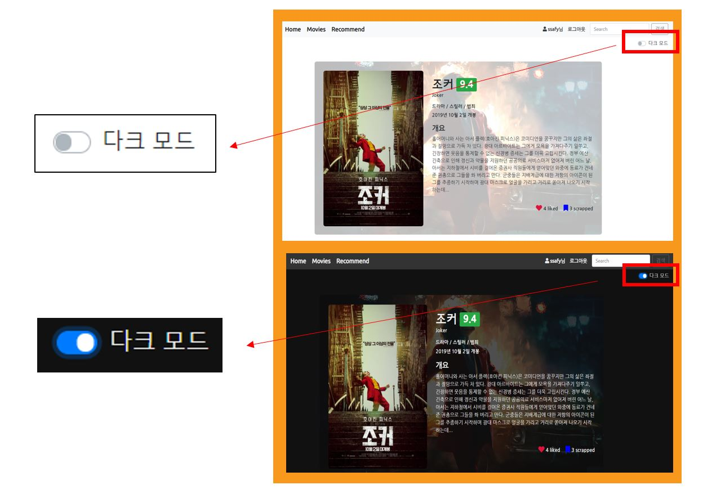
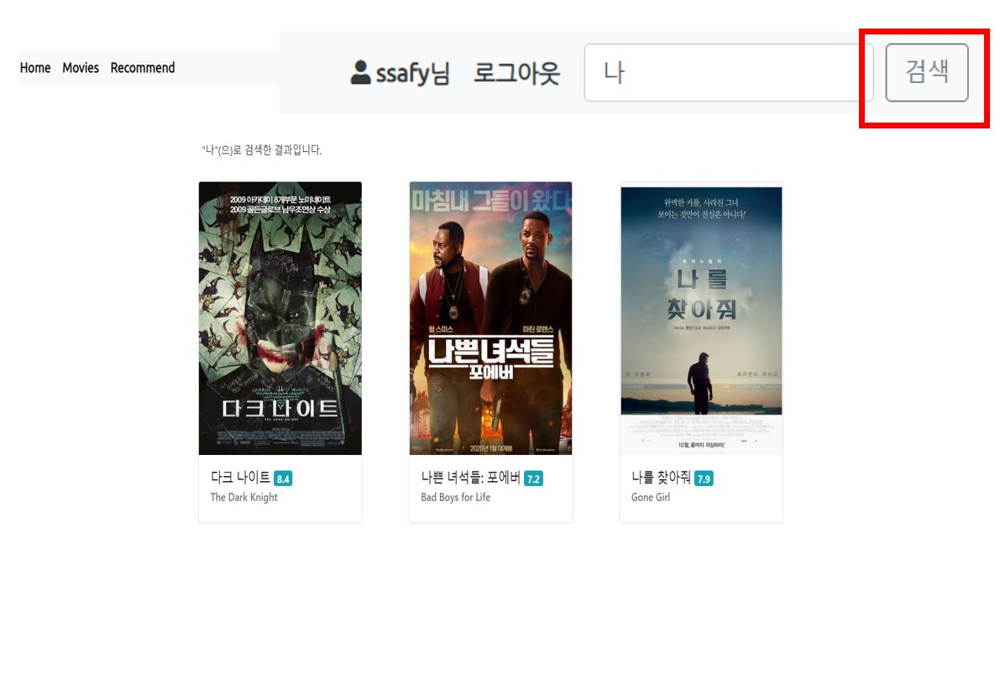
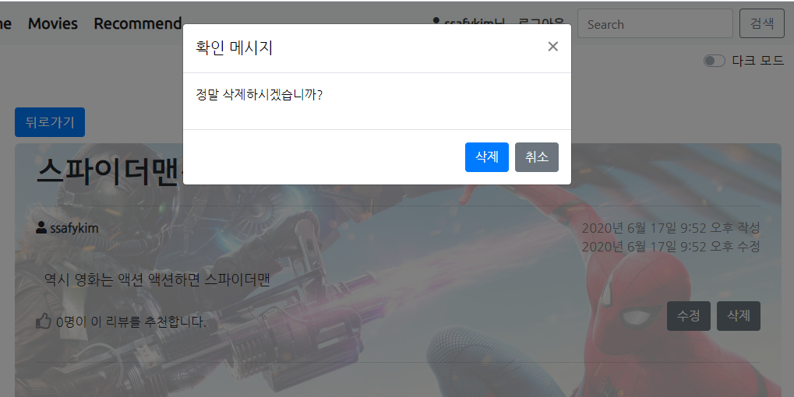
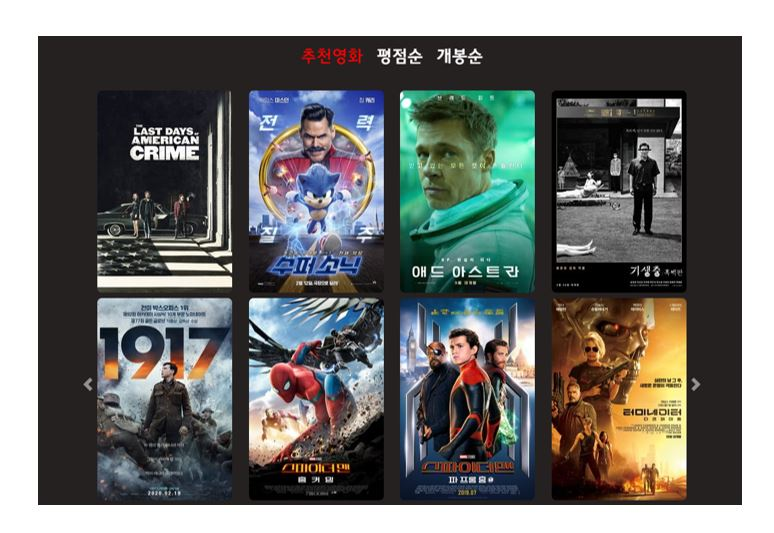
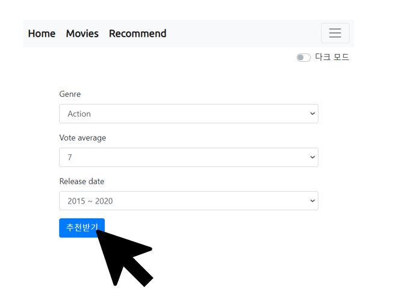
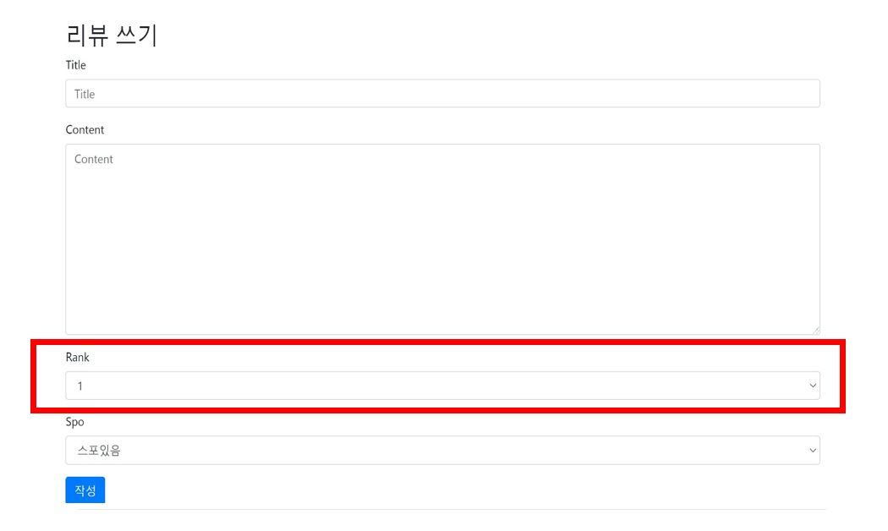

# Final_PJT

## 업무 분담

1. 팀원 : 권남선

2. 업무 분담

   대부분 공동작업 

   김지은 : 영화 상세 페이지 중점적으로 맡음

   권남선 : 홈페이지 중점적으로 맡음

## 목표

#### 1. 사용자 친화적 홈페이지 개발

#### 2. 사용자 맞춤 영화 추천 제공


#### 실제 구현 정도

1. 사용자 친화적 홈페이지 개발

   - 좋아요 & 스크랩

     

   - 다크모드

     

   - 검색기능

     

   - 삭제 확인 메시지

     

2. 사용자 맞춤 영화 추천 제공

   - 사용자에게 자동으로 추천

     

   - 사용자가 선택한 옵션에 따라 추천

     


## 필수 기능

#### 1. 관리자 뷰

- admin 사이트에 들어가야지만 영화를 등록/수정/삭제 할 수 있고 유저 관리가 가능합니다.

  

#### 2. 영화 정보

- The Movie Database에서 API로 영화 데이터를 받아왔습니다.

- 영화 장르 데이터와 인기순 영화 데이터를 받아왔습니다.

  ```python
  # 영화 JSON 파일 받아오기 (original)
  data = {"results": []}
  for i in range(1, 6):
      API_URL = f'https://api.themoviedb.org/3/movie/popular?api_key=ed87f11a9d1a8ca94369a8acb370c42a&language=ko-KR&page={i}'
      response = requests.get(API_URL).json()
      for value in response["results"]:
          data["results"].append(value)
  movie_data_original = data
  
  with open('moviedata_init.json', 'w') as f:
      json.dump(movie_data_original, f, indent=4)
      
  # 영화 장르 JSON 파일 받아오기 (original)
  API_URL = f'https://api.themoviedb.org/3/genre/movie/list?api_key=ed87f11a9d1a8ca94369a8acb370c42a&language=ko'
  response = requests.get(API_URL).json()
  
  with open('moviegenre.json', 'w') as f:
      json.dump(response, f, indent=4)
  ```

- 받은 영화 데이터를 Django model 포맷과 같은 형식으로 가공한다.

  ```python
  final_data = list()
  
  # 영화 장르 데이터 Django json형식으로 변환
  with open('moviegenre.json', 'r', encoding='UTF8') as f:
      genre_json_data = json.load(f)
  
  genre_datas = genre_json_data["genres"]
  for genre_data in genre_datas:
      genre_data["model"] = "movies.genre"
      genre_data["pk"] = genre_data.pop("id")
      genre_data["fields"] = {"name": genre_data.pop("name")}
      final_data.append(genre_data)
  
  # 영화 데이터 Django json 데이터 형식으로 변환
  with open('moviedata_add.json', 'r', encoding='UTF8') as f:
      movie_json_data = json.load(f)
  
  movie_datas = movie_json_data["results"]
  key_name = set()
  for movie_data in movie_datas:
      movie_data["model"] = "movies.movie"
      movie_data["pk"] = movie_data.pop("id")
      movie_data["fields"] = {}
      for key, value in movie_data.items():
          if key != "model" and key != "pk" and key != "fields":
              movie_fields = movie_data["fields"]
              movie_fields[key] = value
              key_name.add(key)
  
  for movie_data in movie_datas:
      for key in key_name:
          del(movie_data[key])
  
  for movie_data in movie_datas:
      if movie_data["fields"]["adult"] == False:
          final_data.append(movie_data)
  
  with open('moviedata.json', 'w') as f:
      json.dump(final_data, f, indent=4)
  ```

- 모든 로그인 된 유저는 영화에 대한 리뷰를 작성할 때 평점 등록/ 수정 / 삭제 등을 할 수 있습니다.

  


#### 3. 추천 알고리즘

- 사용자에게 자동으로 추천
  - 로그인을 하지 않은 사용자나 영화에 좋아요를 누르지 않은 사용자는 랜덤으로 10개의 영화가 추천됩니다.
  - 사용자가 영화에 좋아요를 누르면 영화의 장르 데이터로 상위 3개의 장르를 뽑아서 각 비율에 맞춰서 총 10개의 영화가 추천됩니다.
- 사용자가 선택한 옵션에 따라 추천
  - Nav bar에 있는 Recommend 버튼을 누르면 사용자가 원하는 영화를 추천받을 수 있습니다.
  - 사용자는 장르, 평점, 개봉일을 선택할 수 있고 선택하지 않을 수도 있습니다.


#### 4. 커뮤니티

- 영화 정보에 대한 리뷰를 쓸 수 있고 그 리뷰 글에 댓글을 달 수 있는 기능을 구현했습니다.
- 로그인한 사용자만 리뷰를 작성할 수 있으며 본인만 글을 수정 / 삭제할 수 있습니다.
- 리뷰 글을 삭제할 때 확인창을 보여줍니다.
- 사용자는 작성된 리뷰에 댓글을 작성할 수 있으며 본인만 댓글을 수정 / 삭제할 수 있습니다.
- 각 리뷰 및 댓글은 생성 및 수정 시각 정보가 포함되어야 합니다.
- 리뷰를 작성할 때 스포여부를 체크할 수 있습니다.


